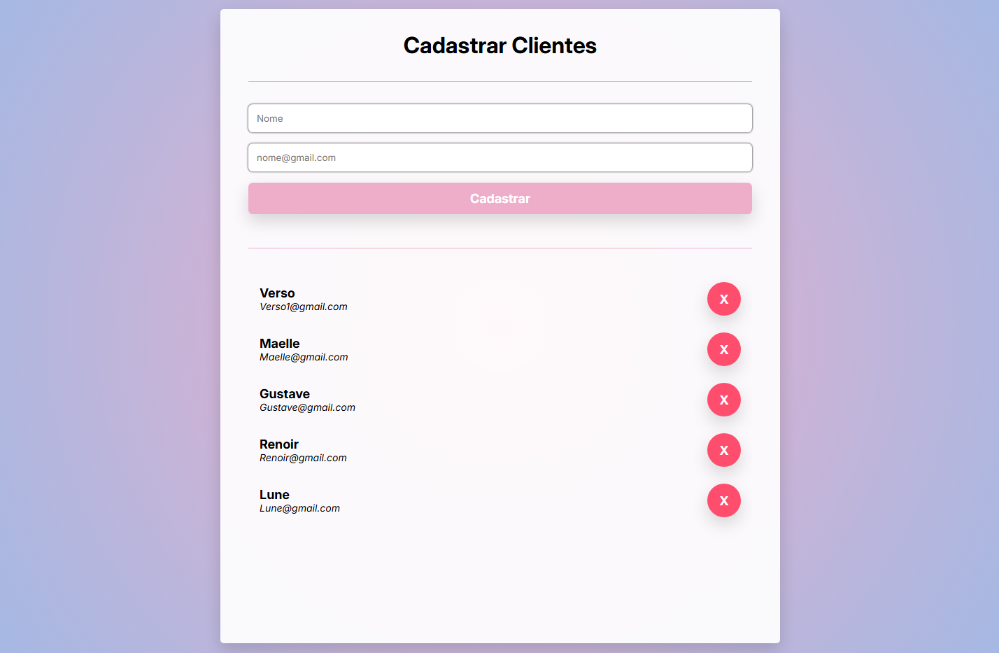
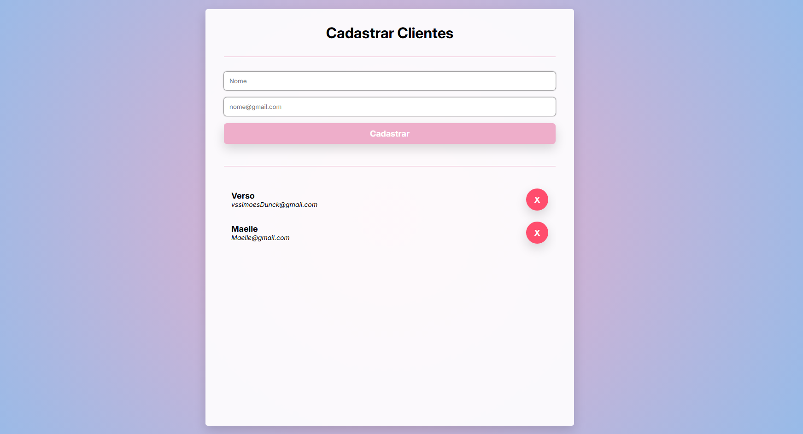

# EBAC Front-End

## Project Showcase

Uma breve visualização de cada projeto desenvolvido ao decorrer dos módulos.

### Modulo 4

#### Competências

- Operadores lógicos
- Operadores relacionais
- Variável

#### Tarefa - Calculadora IMC

### Modulo 6

#### Competências

- Estruturas de dados (Array)
- Laços de repetição
- Estruturas Condicionais
- Funções

#### Tarefa - Jogo de adivinhação

### Modulo 7

#### Competências

- Programação orientada a objetos
- Herança
- Encapsulamento
- Polimorfismo

#### Tarefa - Parquímetro

### Modulo 8

#### Competências

- LocalStorage
- Fetch API

#### Tarefa - Formulário de endereço com persistência no localStorage

### Modulo 9

#### Competências

- Modelo Cliente servidor
- HTTP e HTTPs
- Protoclos HTTP
- Ciclo de vida de uma requisição HTTP

#### Tarefa - Cadastro de clientes com a API CRUD CRUD

### Modulo 10

#### Competências

- Programação Assíncrona
- Programação Funcional
- Modularização POO e boas práticas

### Tarefa - Tarefa anterior com POO e boas práticas

### Modulo 11

#### Competências

- Flexbox
- Grid
- Alinhamento e ajustes de layout

### Modulo 12

#### Competências

- Estrutura BEM

### Modulo 13

#### Competências

- SCSS
- Parcias
- Mixins

#### Tarefa - Agency Web Design

### Modulo 14

#### Competências

- Boostrap
- Container Boostrap
- Boostrap Responsive

#### Tarefa - Cut Shop

## Setting up

Comandos e tutoriais importantes usados para configurar tecnologias externas.

### SCSS

O SCSS permite trabalhar com o css escrevendo menos código e com menos repetição, além de que ele permite uma reutilização de código, uma melhor manutenção e organização.

Download (npm)

<pre>npm install -g sass</pre>

Ativar watch (sempre que o arquivo scss mudar ele converter para o css)

<pre>npx sass --watch arquivoSCSS arquivoCSS</pre>

Manter os arquivos scss divididos em parcias e styles.scss, parcias são todos os arquivos scss divididos em componentes e styles.scss é o arquivo global que será convertido no css principal.

Documentação  
https://sass-lang.com/documentation/syntax/

### Boostrap

É um framework com uma série de classes já definidas para utlizar sem a necessidade de construir tudo do zero com css.

Download

<pre>npm i bootstrap@5.3.8</pre>

Documentação:  
https://getbootstrap.com/docs/5.3/getting-started/introduction/
